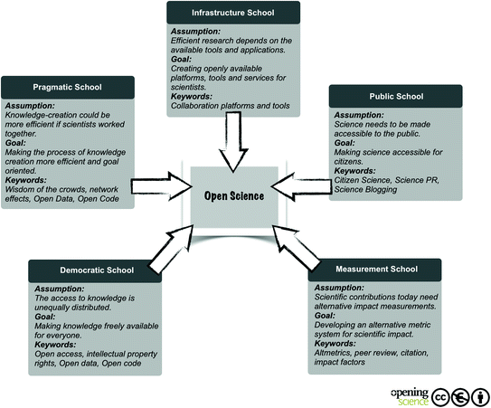

### Lesson 1: WHAT: Intro to Open Science: What is it and what does it promote?

**Lesson Outline**

#### Introduction

This is the first lesson in the module on the Ethos of Open Science. We’ll start explaining what we mean by the word, “ethos”. Ethos is defined by Merriam-Webster as “the distinguishing character, sentiment, moral nature, or guiding beliefs of a person, group, or institution”. So this lesson is about what makes Open Science, as an approach to knowledge-production, unique or distinguishable from other scientific methods.

Note that “ethos” is not exactly “ethics”, but it is a broad enough term to include the moral attitudes held by the individuals or institutions practicing open science. To make it clear that there is a moral element to this discussion, we speak of “responsible Open Science” going forward.

The lesson introduces the concept of open science as a whole, by explaining the history underpinning open science, what open science is, and how it works. It then discusses different components of open science and the pillars that make them up. At the end of the lesson, students will have an understanding of the brief history of open science and its definition.

Open science goes beyond publishing– it is a redefinition of scientific collaboration and output. It is a culture intended to promote science and its social impact. Open science creates new opportunities for different stakeholders including researchers, decision makers, and public participants. Open science increases study transparency, repeatability, reproducibility, and confirmation. We expand what these terms mean and why they matter throughout this module and later OpenCore modules.

#### Context and Definition

Science evolves through collaborative development of theories and practices that are open for others to learn and build on. Throughout the ages - whilst in some cases, education and science was out of reach for the general populace and may have been kept for a privileged few, there have been other educational and scientific resources that were purposefully made available for others to re-use. Think of how dictionaries and encyclopedias have been around for centuries specifically to share standards of knowledge. ([The first](https://oi.uchicago.edu/research/publications/assyrian-dictionary-oriental-institute-university-chicago-cad) “dictionary” dates back over 3,000 years!) Libraries, in turn, have existed for millennia to serve as repositories of knowledge in diverse formats, from ancient tablets and scrolls, to the books we expect to see today. Public museums have also been around for some time and play the role of educating people, as well as maintaining archives for researchers to gain further insights from.

Institutions and practices throughout the ages have facilitated humanity’s endless desire for knowledge. As far back as the Medieval era, we already find physicians being encouraged to review one another’s work to ensure it was carried out appropriately (Rogers, [2021](https://doi.org/10.1308/rcsann.2020.0214)). Today, we call this practice “peer review”. And, during the Enlightenment, scientists formed networks with whom they shared their theories via hand-written letters, and the adoption of the printer allowed for the emergence of scientific institutes and journals (Green, [2017](https://www.wiley.com/network/societyleaders/open-science/an-illustrated-history-of-open-science); see Kherroubi Garcia et al., [2022](doi.org/10.5281/zenodo.5731452)).

However, open science has only become a distinct set of practices in recent decades. We can see open science as both being encouraged by social and technological developments, and responding to problems in the scientific process. The emergence of the internet and other digital technologies have more recently allowed for science to be conducted even more collaboratively. In 1971, [Project Gutenberg](https://www.gutenberg.org/about/background/history_and_philosophy.html) started making books in the 📖public domain📖 available online. In 1987, we saw [the first open access](https://uh-ir.tdl.org/handle/10657/5149) 📖[journal](https://uh-ir.tdl.org/handle/10657/5149)📖 being published. In 1991 the central storage platform arXiv was launched for the exchange of manuscripts in physics (though without 📖peer review📖) (Ginsparg, [2021](https://doi.org/10.1038/s42254-021-00360-z)).

However, these endeavors do not amount to open science in the sense we discuss it today. In recent years, we have learned of various issues in the scientific process that necessitate specific responses. Two such issues are the 📖replication crisis📖 (Fidler & Gordon, [2013](https://theconversation.com/science-is-in-a-reproducibility-crisis-how-do-we-resolve-it-16998); Elsherif et al., [2021a](https://forrt.org/glossary/reproducibility-crisis-aka-replicab/)) and 📖publication bias📖 (Joober, et al., [2012](doi.org/10.1503/jpn.120065); Elsherif et al., [2021](https://forrt.org/glossary/publication-bias-file-drawer-proble/)b). The replication crisis refers to scientific findings not being validated by other scientists’ efforts to replicate them. The publication bias amounts to the greater ease to publish scientific findings that only “very clearly” confirm or disprove hypotheses.

Thus, open science captures both the spirit of making knowledge more accessible _and_ responding to poor scientific practices. We will discuss more reasons why open science is important, both the personal benefits and as a public good, in 🔗Lesson 2 of this module, “Benefits and Challenges of responsible Open Science: Why does it matter?”🔗

#### Definitions of Open Science and responsible Open Science

Formal definitions and governance mechanisms to ensure best practices in open science have emerged alongside the open science movement.

* In 1997, [COPE was established](https://publicationethics.org/about/our-organisation) and has since supported the fostering of responsible publishing culture.
* The [2001 Budapest Open Access Initiative](https://www.budapestopenaccessinitiative.org) provided a clear working definition of _open access_, one of the components of open science (as we will see shortly).
* In 2012, the [Contributor Role Taxonomy](https://credit.niso.org) was developed so that more diverse collaborators in research can be adequately credited for their work.
* The [2013 Declaration on Research Assessment](http://doi.org/10.1242/dmm.012955) then outlined best practices in the assessment of research.
* In 2014, the [Open and Collaborative Science in Development Network](https://ocsdnet.org/about-ocsdnet/) was established to enable open science approaches to developmental research for the Global South.
* 2014 also saw the launch of the [Data Citation Principles](https://force11.org/info/joint-declaration-of-data-citation-principles-final/), which advocate for – amongst other things – making data independently citable.
* The [2016 FAIR principles](https://www.go-fair.org/fair-principles/) emerged as a way to guide practices in open science, and enabled the implementation of the Data Citation Principles.
* The [2018 CARE principles](https://www.gida-global.org/care) established data governance practices for indigenous data and practices.
    
In this complex context, we can draw on a few definitions of _Open Science_:
    
“Open Science is transparent and accessible knowledge that is shared and developed through collaborative networks” (Vicente-Saez & Martinez-Fuentes, [2018](https://doi.org/10.1016/j.jbusres.2017.12.043)).
    
“Open science is \[...\] an inclusive construct that combines various movements and practices aiming to make multilingual scientific knowledge openly available, accessible and reusable for everyone, to increase scientific collaborations and sharing of information for the benefits of science and society, and to open the processes of scientific knowledge creation, evaluation and communication to societal actors beyond the traditional scientific community. It comprises all scientific disciplines and aspects of scholarly practices, including basic and applied sciences, natural and social sciences and the humanities, and it builds on the following key pillars: open scientific knowledge, open science infrastructures, science communication, open engagement of societal actors and open dialogue with other knowledge systems (UNESCO, [2021](https://unesdoc.unesco.org/ark:/48223/pf0000379949.locale=en)).
    
Globally, Open Science is being valued and given importance as it recognizes disparities and regional differences, providing a framework to handle challenges and contribute to minimize knowledge, technological and digital differences between countries. For instance, when different researchers from across the globe are invited to research collaboratively, trust and novelty increases and as a result it improves quality, efficacy and responsiveness in research as being the benefits of Open Science.
    
Here are some other definitions of Open Science. Are there any more you would add?
    
_Open Science is a practice for increasing the accessibility and transparency of scientific research. The concept of Open Science is built around shared principles such as inclusion, fairness, equity, & sharing (Zee & Reich, [2018](https://doi.org/10.1177/2332858418787466))._
    
_An umbrella term reflecting the idea that scientific knowledge of all kinds, where appropriate, should be openly accessible, transparent, rigorous, reproducible, replicable, accumulative, and inclusive, all which are considered fundamental features of the scientific endeavor. Open science consists of principles and behaviors that promote transparent, credible, reproducible, and accessible science. Open science has six major aspects: open data, open methodology, open source, open access, open peer review, and open educational resources. (FORRT open science glossary, [https://forrt.org/glossary/open-science/](https://forrt.org/glossary/open-science/))_
    
#### Open Science aspects
    
Open science has various components: open access, open access journals, open peer review, open research data, open source, open science policies, with use of open licensing, open software for reproducible research, among others (Open Science Basics, retrieved from [https://open-science-training-handbook.gitbook.io/book/open-science-basics](https://open-science-training-handbook.gitbook.io/book/open-science-basics), 2022).
    
The below image from Robinson ([2018](https://osaos.codeforscience.org/what-is-open/)) captures some of the components of open science, although the list differs depending on who you ask (see Pontika et al., [2015](http://dx.doi.org/doi:10.1145/2809563.2809571)).
    

    
(Image from Robinson, [2018](https://osaos.codeforscience.org/what-is-open/); needs adapting in light of the list below)
    
_Open Science_ is an umbrella term that captures eight components. The below list helps us reflect on the ambition that drives the open science movement. In short, open science is not limited to a discipline or a particular aspect of scholarly practice. Rather, open science seeps into every practice of scholarly work.
    
* **Open Access** refers to making research methods, data and outputs accessible by default, where advisable; this is touched on in lesson five below.
* **Open Data** relates to making data used in science accessible for others to study, re-usable for other pertinent projects, and available for redistribution. More on this topic will be discussed in the module _Open Data_.
* **Open Software** is about making the source code of software transparent, allowing people to collaborate on its improvement; more will be said in the module _Open Software_.
* **Open Tools & Resources** are those that have been developed precisely to facilitate open science practices, from open hardware and online toolkits to behavioral guidelines; learn more in the module _Open Tools & Resources_.
* **Open Results** is a broad term capturing open access, open data and open software, as it is about making results from all stages of a research lifecycle open, including their evaluation, which should not be limited to traditional peer review; learn more in the module _Open Results_.
* **Open Educational Resources** are learning and teaching materials made available through 📖[open licenses](https://forrt.org/glossary/open-licenses/)📖 that permit no-cost access, re-use, re-purpose, adaptation and redistribution by others (see [UNESCO’s explainer](https://www.unesco.org/en/communication-information/open-solutions/open-educational-resources)); note that the present TOPS OpenCore is an example of such a resource!
* **Equity, Diversity, Accessibility and Inclusion** are crucial values for the growth and sustainability of open science practices, as they foster the wellbeing of open science practitioners and communities. Shared principles about responsible scientific outputs also shape the behaviors of open science communities, with codes of conduct as a mechanism to ensure inclusive practices (see the following component of open science).
* **Open Community Practices** refers to the fact that open science is conducted by communities of practitioners that foster collaborative working environments, beyond disciplinary boundaries and professions; this is touched on when discussing stakeholders in lesson three of this module.
        
#### There is no _one_ ethos
        
It is important to note that there is no one unique way of practicing or conducting open science. The outlined categories show us the diversity of practices involved in open science. Research has also shown that there are at least five schools of thought in open science, each one holding different assumptions and striving for different goals (Fecher & Friesike, [2013](https://doi.org/10.1007/978-3-319-00026-8_2)):
        

        
Diverse practices, assumptions and goals are just part of the complexity of open science. There are also divergent moral principles guiding open science communities. Such principles are captured in 📖_codes of conduct_📖. A code of conduct is a community governance mechanism that outlines the principles and practices expected of a given research community’s members, as well as the process for investigating and reprimanding those in violation of the code.
        
In a sense, a code of conduct constitutes the moral backbone of a research community. However, as with the numerous schools of thought, there are similarly many codes of conduct. In other words, there is no _one_ set of universal principles that all open science practitioners abide by. For example, consider how [OLS](https://openlifesci.org/code-of-conduct), [INOSC](https://osf.io/6gsye), [allea](https://allea.org/portfolio-item/the-european-code-of-conduct-for-research-integrity-2/), [AGU](https://www.agu.org/Plan-for-a-Meeting/AGUMeetings/Meetings-Resources/Meetings-code-of-conduct) and [Ethical Source](https://ethicalsource.dev/community-code-of-conduct/) all have different codes of conducts and guiding principles.
        
This great diversity responds to the growing proliferation of open science initiatives and the great use we can make of open science approaches to knowledge.
        
One of the biggest driving forces is the effect of open science on the research performance. Indeed, some studies have even found that the best-performing universities are those that conduct science following open practices (see Huang et al., [2020](https://doi.org/10.7554/eLife.57067)). More will be said in the following lesson about the benefits of open science and different stakeholders.
        
For now, consider some of the regional policies encouraging open science:
        
* The European Commission ([2017](https://data.europa.eu/doi/10.2777/121253)) has outlined the skills and competencies researchers need to practise open science;
* The National Academies of Sciences, Engineering and Medicine ([2018](https://doi.org/10.17226/25116)) promotes open science by design as a vision for 21st century research;
* UNESCO ([2021](https://unesdoc.unesco.org/ark:/48223/pf0000379949.locale=en)) has developed a series of recommendations to ensure best open science practices, which are conducive to the United Nations’ [Sustainable Development Goals](https://sdgs.un.org/goals);
* The European Open Science Cloud (EOSC) for finding and re-using data, and the Open Research Europe (ORE) publishing platform (European Commission, [2021](https://data.europa.eu/doi/10.2777/18252)).
            
Ultimately, open science practices guide approaches to knowledge-creation that best help confront the challenges of our era. Through this module and the wider TOPS curriculum, you can become a part of this impactful movement.
            
#### Performing open science _responsibly:_
            
**Responsible Open Science** is a term we use through the rest of the module. We define it as: considering open science as the core of your science project and maximizing ethical actions for open science to minimize current challenges (e.g. data sharing, inclusion, and accessibility). In responsible Open Science, the best possible and practical practices should be explored at the early stage of your science project.
            
Here we share with you following rules of thumb:
            
* Using best practices where possible
* Being practical and realistic about resources available and pressures on open science practitioners
* Not sharing things that shouldn’t be shared
* Being inclusive of all people
                
#### Summary
                
In this lesson, we have learned a brief history of open science, its definition, and the ethos of open science and definition of responsible Open Science. Open science practices provide significant advantages relative to more traditional closed practices. However, there are still problems that must be addressed, which many view as obstacles to open science. In the next lesson, we will talk about the benefits of open science and its challenges.
                
#### Further Reading:
                
Below are some further readings regarding this module:
                
1. [Open Science : One Term, Five Schools of Thought](https://link.springer.com/chapter/10.1007/978-3-319-00026-8_2)
2. [How open science helps researchers succeed](https://elifesciences.org/articles/16800)
3. [Developing a Toolkit for Fostering Open Science Practices: Proceedings of a Workshop](https://nap.nationalacademies.org/read/26308/chapter/1)
                    
National Academies of Sciences, Engineering, and Medicine. 2021.
                    
1. Reproducibility and Replicability in Science. Washington, DC: The National Academies Press. [https://doi.org/10.17226/25303](https://doi.org/10.17226/25303) .
2. Open Science and Radical Solutions for Diversity, Equity and Quality in Research: A Literature Review of Different Research Schools, Philosophies and Frameworks and Their Potential Impact on Science and EducationGong, “Open Science.”[https://doi.org/10.1177/20966083221091867](https://doi.org/10.1177/20966083221091867)
3. Book by Miedema, Open Science. [https://doi.org/10.1007/978-94-024-2115-6](https://doi.org/10.1007/978-94-024-2115-6)
                        
Further reading on terms and definitions:
                        
1. Open Science glossary from the FORRT (Framework for Open and Reproducible Research Training) [https://forrt.org/glossary/open-science/](https://forrt.org/glossary/open-science/)

#### Questions/Reflection:

##### Questions for students of the course:
- How has research practice changed over the past few decades ?
- As a researcher how do different components of responsible Open Science transform knowledge contribution?
- We learned that there is "no one ethos" in this lesson. Can you explain what this means, and why? 

