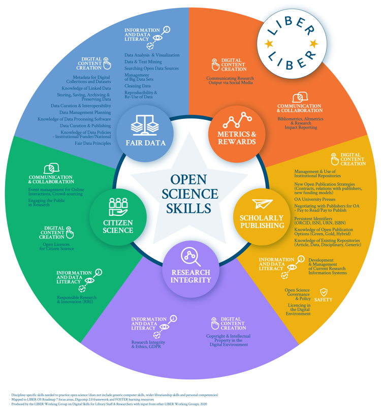

# Not an afterthought

Previous lessons have shown the importance and benefits of open science, presented some key stakeholders involved, and discussed the barriers to participation and ways to overcome them. This lesson will guide you in how to start infusing responsible Open Science in your own work, which might be independent, or could be in a research group or lab. 

## Plan for open science into the design

Practicing responsible Open Science requires organizing your work and research, and your team, if you have one, around open science and planning for it from the inception, even designing the project with open science in mind.  There are many resources and tools that make these easy, and indeed doing so will improve efficiency and the value and impact of your work, and help you focus on your research itself.  We’ll provide a brief overview in this lesson, but you may wish to explore the later modules in this course too, which cover 🔗 Open Data, Open Results, Open Tools, and Open Software 🔗. Additional resources, and knowledge, may be available at your institution, including in your department or library or among your colleagues.  An additional resource is a recent report from the U.S. National Academies “[Open Science by Design](https://nap.nationalacademies.org/catalog/25116/open-science-by-design-realizing-a-vision-for-21st-century).”  

It is important to discuss responsible Open Science with your research team, lab, group or partners regularly.  Much of responsible Open Science may seem to be related to outputs – such as data, software, and publications – but preparing and organizing work for these in advance is critical. It would be hard or impossible to follow leading practices for these at the end of research, in the “afterthought” mode. Responsible Open Science is both a mindset and culture.  

Planning for outputs in advance includes: speaking about it and organizing with your research team; deciding which tools to use;  thinking about authorship and credit; engaging with relevant stakeholders and research partners, for example, industry, around open science; identifying repositories for software and data; highlighting these approaches in your grant; and much more.

## Perks of digital and internet age for responsible Open Science:  

The internet has made it very easy to share digital work. The popularization of Open Source computer code and the rise of Open Science has resulted in many outlets for public and free hosting of research and data.One key to open science, and why it is so empowering for 21st century science, is that we can now connect all the participants, stakeholders, and outputs of a research result together so that they are easy to discover. 

Here we present a non-exhaustive list of digital platforms and tools used with for open science:  

- Digital Persistent identifiers - for objects and researchers (such as doi and ORCID)  
- [Open Journal System](https://pkp.sfu.ca/ojs/): open source software  for managing & publishing scholarly journals  
- Electronic notebooks such as [Jupyter](https://jupyter.org/) and [R Markdown](https://rmarkdown.rstudio.com/)  
- Data repositories: genetic sequence database [Genbank](https://www.ncbi.nlm.nih.gov/genbank/), protein data bank ([PDB](https://www.rcsb.org/)), Dataverse, figshare, Zenodo and for wide search use [https://www.re3data.org/](https://www.re3data.org/) and/or [https://datacite.org/](https://datacite.org/)  
- Softwares/Codes: Zenodo used with Github / mybinder  
- Materials: Addgene (for molecular biology)  
- Reference management tools: Zotero, Mendeley  
- Academic Social networks: Academia.edu, ResearchGate  
- Peer Review: Publons, PreView  
- Project management:  Open Science framework 
- Github as a platform for collaborative work on training materials etc  

A variety of tools are emerging to help manage open science workflows, and to support global collaboration.  These include spaces for project management, such as the Open Science Framework from [Center for Open Science, electronic](https://www.cos.io/)  notebooks which help projects organize data, software, and content together; online platforms for creating manuscripts, etc. More information about the open science collaboration and management tools are described in the 🔗Open Tools module🔗.  

Now let’s move to the tools and procedures to ensure credit and attribution for our work, and allow its use and reuse in new, powerful ways, using the internet. 

## Digital persistent identifiers - for objects and researchers

A key to the 📖interoperability📖 is that each piece is assigned a “📖persistent identifier📖” and “📖metadata📖” that provides a secure path and basic information about it in such a way that they can be linked automatically (machine-readable).  

How many times have you gone to an old link, only to find the page is no longer there? A persistent identifier is powerful because it is designed to point to the Web resource even if, or when, the URL or domain changes. One very common type of persistent identifier is a "📖digital object identifier” (DOI)📖 that is usually assigned to a digital object (e.g. document) by publishers, preprint servers, data and software repositories.  This has allowed automated linking of references across publications, including to citations after a publication.  

## Case scenarios: 

1. A researcher writes a script in R that they use to analyze their results and produce a bar chart. They can upload their R code to a repository, and get a DOI for their script, so others can peer-review the code if they wish. 
2. A member of the public attends a conference online and shares a digital poster and a short talk about their work as a citizen scientist. They deposit their poster and talk slides on to Zenodo, and can share the slides and poster using the DOI URL and receive credit for it. 
3. A consortium member collaboratively authors a paper summarizing  the results of a workshop they attended, alongside other workshop attendees. The journal they publish in automatically assigns a DOI to the paper.

### ORCID: A permanent unique identifier for *you*, as a scientific author

Researchers and authors also have a digital identifier in this system: The Open Researcher and Contributor Identifier or ORCID.  **Thus a first step to enabling responsible Open Science is to sign up for your identifier at [ORCID.org]([https://ORCID.org</a>](https://orcid.org/).** This identifier will be included in your research outputs and work so that they can be linked uniquely to you (this can also happen automatically). You control your information on ORCID and what is public or private. Your ORCID can also be a way to get credit and recognition for reviews, awards, and more.  Many funding agencies now integrate fully with ORCID, for example, for preparing grants and reference lists.

Other identifiers that are regularly used include those for funding agencies–which along with the grant ID provide a connecting link back to their repositories, institutions, 📖samples📖, open reviews, and even 📖annotations on web pages📖.  Identifiers for 📖research instruments📖, 📖reagents📖, and materials are under development and implementation too. 

In most cases, the identifiers will not be managed or assigned by you. Publishers and data repositories may ask you and your co-authors to link your ORCID and provide a grant ID (if you have one!) but they will then automatically provide the digital linking and create the 📖metadata📖 record. Often, you can sign on to repositories using your ORCID, so that this is automatically linked to any work you upload.

Having basic metadata - remember, metadata is documentation *about* your data - for each object with a persistent identifier helps 📖*discoverability📖*.  For publications and datasets, an identifier usually includes the title, authors (with their own identifiers), grants (with identifiers), journal (with its identifier as well, the ISSN), and publication date among other information.  This allows search engines to discover and index the content.  For data sets, leading repositories will also help ensure that information on standards, uncertainty, and calibration are included to allow appropriate reuse.

Collectively, this system allows widespread discovery and connection of the various pieces of research–even connecting open preprints and conference presentations to later versions and publications to data sets that underlie and support them.

## Sharing  data, and software, and getting cited: Repositories you can use

A key part of responsible Open Science, which is enabled by this system, is that research outputs – data sets, software, publications, conference reports, etc. -- should go to the respective places that best manage, curate, and host that type of output. Previously, a data set may have been included as a supplement to a paper, usually a PDF file at a publisher’s site, or not included at all (“data not shown" or “data available upon request” statements were common even a few years ago but are thankfully waning).  

Publishing a data set separately from your paper, at a repository that handles that type of data well (ideally a popular “📖domain repository📖”), allows others to cite your data separately, with its own metadata and authorship and expert curation of that data. Some also allow data that have appropriate restrictions on access (such as personal medical data) to be hosted in a secure way. This allows separate credit and authorship (if appropriate) for data or software products.  A publication or research project may, and often will, have multiple data sets across several leading repositories. 

In general, domain repositories are preferred over a general repository for data, because of the *📖expert curation📖* and better metadata they can provide, but not all disciplines or types of data have appropriate repositories. In this case general repositories can be used. In some cases, you may create and deposit data in a repository throughout a project; in other cases the natural time to “publish” the data is when a paper is submitted to a journal.  

See the 🔗Open data module🔗 for more information on sharing your data appropriately. 

*Open software* is usually developed in a collaborative workspace such as GitHub. Github works with a general repository, Zenodo, to enable software versions to be assigned an identifier and metadata.

Sharing data, codes and software is a key for ensuring reproducibility of findings, improvement of code and software, for enabling other researchers to easily re-use , extend and cite that work ([Gorgolewski & Poldrack, 2016](https://doi.org/10.1101/039354)). Sharing the data & materials is also a signal of valuing transparency and trust in their own research, boosts authors' visibility and recognition [(McKiernan et al., 2016)](https://doi.org/10.7554/eLife.16800).  

See the 🔗Open source module🔗 for more information on sharing your code and software appropriately. 

Collectively, this set of identifiers, metadata, and infrastructure helps enable content and especially research data to be *“findable, accessible, interoperable, and reusable”* or [FAIR](https://www.go-fair.org/fair-principles/). This is a key concept and part of responsible Open Science. For researchers it means directing research outputs to their best open science home and planning for this throughout the research process.  For all these reasons, it is best to think about how to share data and software supporting a publication *before submission*. More about FAIR principles can be found in the 🔗Open Data module🔗, and now we will consider some foundational principles on licensing the content for reuse.

As a general rule, when you create something - a blog post, a scientific paper, a drawing, a data set, computer code, or any other ‘creative’ work - you automatically own the copyright for that work yourself. This means that others **aren’t allowed to re-use it** without your permission, even if it’s freely available on the internet. As an open scientist, you can use a **📖license📖** to grant others permission to re-use your work, and even specify conditions - perhaps you always want others to credit your work, or perhaps you don’t want your work to be used commercially. 

*⚠️Caution:* When you perform work for someone else, as an employee, contractor, volunteer, or a student, your contract may stipulate that the copyright for that work belongs to the institute you are working for. Before assigning a license to your work, check that you have the right to do so. Your employer, institution’s intellectual property office, and your funder may all have specific expectations around how you share your work and what license you use. 

Distributing content to the best open science home also allows each output to have the right license that allows access and reuse. Usually you would include the type of license in the metadata.  When you publish a preprint or publication, or deposit a dataset, or software version at a repository, you will usually be asked about the correct license to assign to that content. Usually a repository will recommend or require a specific license to enable broad reuse. The basic standard is that leading licenses support reuse generally with attribution (citation) so that the creators of the content are recognized. Citations are supported by leading publishers.

Here we list a general guide on the best licenses for published content, data, and software:

### Written content of any kind, papers, posters, slides, images, audio files, videos, other creative works 

*[Creative Commons licenses](https://creativecommons.org/)* are designed to allow re-use of these types of content. Authors can choose to require **credit** for their work (CC-BY attribution), allow or disallow **commercial use** and/or **derivative works**, and to require [reciprocal sharing](https://en.wikipedia.org/wiki/Share-alike) of works. 🔗Open Results Module for more information🔗

### Data

Including spreadsheets/csv/text files with experiment results, videos/audio files/images created from a study, databases of computationally processed data.

[Creative Commons Public Domain (CC0) licenses](https://creativecommons.org/publicdomain/zero/1.0/) are often best for data. Whilst you may be tempted to use a creative commons attribution license (CC-BY), this can make it difficult for people who wish to reuse or integrate different data sources in the future. Visit the 🔗Open Data Module for more information🔗.

### Computer code, such as scripts written in R, Python, Matlab, SPSS

[The Open Source Initiative](https://opensource.org/licenses) has a set of licenses designed specifically for code projects, that covers both open distribution of the code itself, as well as executable versions of the program that non-programmers can run. Visit the 🔗Open Source Module for more information🔗

Other items: Whilst this is beyond the scope of the module, this list is not exhaustive. Other types of work may require different license types. For example, what license would you use for an open hardware drone design, a 3d-printed microscope kit, or a reagent used in a laboratory? These items may have different constraints and needs.   

*⚠️Caution*: As a general rule, if an item does not include a license for reuse, it’s illegal to reuse even if you can see the work online. Licenses are designed to take into account the legal ins-and-outs that each type of work can encounter. Try not to use one license type for a different output - Creative Commons specifically advises *[not to use their licenses for computer code](https://creativecommons.org/faq/#can-i-apply-a-creative-commons-license-to-software)*, for example. 

## Making your work useful to others: 

### Sharing and publishing your manuscript:

#### Public repository/Preprints

Sharing drafts of research as preprints can improve citations and help establish or provide credit and a reference months before formal publication in the journals ([McKiernan et al 2016](https://doi.org/10.7554/eLife.16800)) A manuscript posted by author(s) to a repository for facilitating open sharing of early work without any limitations to access is *📖Preprint📖 ([Puebla et al 2022](https://doi.org/10.3998/mpub.12412508))*. Basic screening is carried out to the manuscript, which is usually posted on the preprint server within a few days of submission without peer review and is freely accessible online. More than 1200 journals now allow posting of preprints, and some connect directly to deposit submitted manuscripts directly (see directory here: [https://v2.sherpa.ac.uk/romeo/](https://v2.sherpa.ac.uk/romeo/)) or allow transfer from the server to the journal. Many funding agencies now allow citations of preprints in grants. Many preprint repositories are field-specific; see a directory here: [https://asapbio.org/preprint-servers](https://asapbio.org/preprint-servers). Many also will link to the published version of the manuscript once it is available.

In addition, many institutions have open sharing repositories, and mandates to share author-versions of published manuscripts. Many funders also have repositories for sharing manuscripts after publication or a means to connect to manuscripts on publisher platforms. Check with your institution or funder, and journal publisher for requirements.

Some preprint repositories also accept conference presentations (e.g. posters and slide decks for talks). 

#### Publishing Open Science and Open Access

When you publish your work in peer-reviewed journals, traditional publishing models may result in papers that are not openly available for anyone to access, and instead may require a subscription fee. Publishing in subscription journals is usually without cost, but where possible we recommend using “Open Access” publications. There are many routes to open access publishing, discussed further in the tools module, often with different trade-offs - for example, if a scientist has to pay to publish in an open access journal, fewer scientists can afford to share their work! 

### Discipline- and sector-specific nuances

The above information applies across nearly all scholarly disciplines. There are some discipline or research specific responsible Open Science steps that also apply or for which you should think and learn about:

For some fields of research, 📖pre-registration of hypotheses📖–as a publication–is strongly encouraged and it helps avoid bias and supports the publication of negative results. These are becoming common in behavioral and social sciences and clinical trials. We explored this previously in lesson 2.

If your research involves partnering with *industry* where some outcomes may be restricted from publication, it is best to discuss and reach agreement in advance on responsible Open Science outputs to avoid complications or misunderstanding at the time of publication.  If you have one, consult your institutional legal, knowledge transfer or intellectual support office resources should be consulted to be clear that publication of relevant data and software are acknowledged and supported and that data can be placed in appropriate repositories.

#### Working with physical samples and tools: 

Some disciplines also require or encourage sharing of physical materials such as reagents, cell lines, animal models, and materials and have repositories for these, which will also provide appropriate licenses.

If you are collecting or analyzing physical or biological samples, a permanent identifier system has been developed to help you manage your work, support open science, and enable standard methods for identifying, citing, and locating physical samples and comparing analyses from different labs–the [IGSN](https://www.igsn.org/) or International Generic Sample Number. Identifiers can be reserved in advance (before collecting). Additional information is in the Data module

Some disciplines in paleontology and anthropology also require and expect open archiving of precious samples in public museums and/or other means to provide open access (digital casts).

If your research involves field work and sample collection, appropriate permits should be obtained including engagement with local authorities and stakeholders–including them openly in your research has many benefits, as we discussed in Lesson 3.  

Work on human data and samples, and other sensitive areas often requires initial external ethical review, e.g. in the US by an Institutional Review Board (IRB).

### Authorship: recognizing the contributions  and giving credit

Working in collaboration and with the teams of researchers oftentimes led to sour disputes on the order of the authors at the stage of the final publication. It is important to remember that practicing open science responsibly implies giving the credit to the contributors in an equitable, fair and ethical way. Here, open science calls  upon the knowledge and practices of research integrity and ethics. Separate, unique citations for a variety of outputs (such as data sets, software), expanded and refined contributors roles, such as [CRediT taxonomy](https://credit.niso.org/), are crucial in recognition and giving the credit.  Importantly, all involved stakeholders such as publishers, funders, regulatory bodies, and research institutions need to consider recognizing diverse contributions and especially [open data in their evaluation systems](https://doi.org/10.1038/d41586-022-00921-x).

For in-depth, check the [COPE’s materials](https://publicationethics.org/authorship) on authorship and contributorship.

## Summary: think beforehand, design for open science, never as an afterthought.

It is important to think about, discuss, and plan for desired outcomes and processes when you begin your research.  Learn about where the best repositories are for your data; discuss credit and authorship for each separate open science output, and start using open science tools to organize your work.  Reach out to repositories in your discipline and institution (usually library) for help.  Indeed this information in your grants and data management plans will make you more likely to receive funding.

## Bonus section: Open Science Skills

Open science can foster a range of skills, across many domains - the figure below touches on some of the topics you may have learned about so far. 

You may have expected to see technical/data science skills, digital content creation, research management, library and information, and publication literacy.  Research integrity and ethics are often less straightforward sets of skills, in which researchers  may not be trained or aware of.

Each step of responsible Open Science involves considering and thinking about other people - collaborators, contributors, users and consumers of the research outputs. Therefore, communication and interpersonal skills, especially applied to virtual environments, are key.   

In this module, we emphasized ethos and ethics of open science, inclusion and accessibility in participation of open science stakeholders, equity (or lack of it) in conducting and sharing science openly. responsible Open Science researchers of the 21st century need to develop their [reflective practice](https://libguides.cam.ac.uk/reflectivepracticetoolkit/whatisreflectivepractice), just like practitioners,  to enable them to become aware of their own stance towards science or assumptions regarding other stakeholders, aware of the values and worldviews, and provide means to adapt the responsible Open Science practice. ([Roedema et al 2022](https://doi.org/10.22323/2.21040202))

[Source](https://doi.org/10.5281/zenodo.3702401) of the visual 

## Summary of the module

This module provided a broad overview of the *ethos* of responsible Open Science, the imperative for scientific and societal challenges and opportunities in the 21st century,  and an introduction to how you and your research team can begin to follow leading practices to enable open science.  Part of the ethos is to help enable these practices within your team and with your colleagues–that is, you are encouraged and empowered to share what you have learned and help them learn about, be aware of, and practice Responsible Open Source.

In a larger context, many of you will be participating in scholarly efforts, including in peer review, in leadership positions as journals and societies, in organizing meeting sessions, and more. Enabling responsible Open Science is a broader cultural shift in scholarly practices worldwide. In many ways, the recognition, reward and award systems in science are not fully aligned yet with responsible Open Science as this cultural shift is ongoing.  You are encouraged to leverage this learning in having conversations to develop this culture broadly.

Here are the six key guidelines to start practicing and supporting open science responsibly:  

1. Plan for responsible Open Science from the beginning and begin discussions in your group, with colleagues, and your librarian.
2. Plan for making data and code open and available in leading repositories and citing it in publications in the reference section. Cite others’ data and software that you make use of.
3. Learn about and adopt open science tools
4. Develop and foster inclusive workgroups, meeting sessions, and meetings.
5. Learn the routes to make your publications open and what your institution supports and funders require; preprints provide an easy and robust route
6. Support and inform your colleagues.

## Questions/Reflection:
 
- How can a researcher publish in an open access journal ? 
- Predatory journals are very harmful and some early career researchers may not be even familiar with these journals. Describe why they should be not included in responsible Open Science. Also discuss what are the possible  ways to restrict and control these journals? 
- Why are licenses an integral part of Open Science practice ? 
- Can you briefly describe the differences between licence types? When conflicts arise among co-authors about which types of licenses they should choose, how do you discuss and resolve the issue using your knowledge learned from this lesson? 
- What are two types of permanent identifiers, and why are they useful? 

